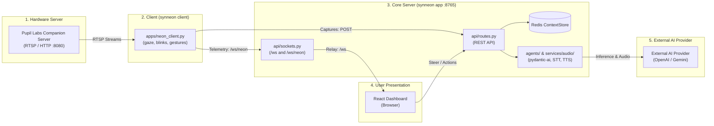
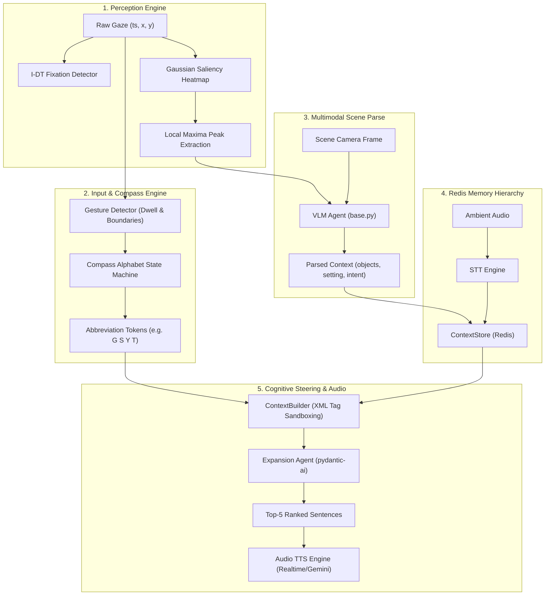

```mermaid
graph LR
    subgraph HARDWARE["1. Hardware Server"]
        NEON_DEV["Pupil Labs Companion Server<br/>(RTSP / HTTP :8080)"]
    end

    subgraph CLIENT["2. Client (synneon client)"]
        CLIENT_APP["apps/neon_client.py<br/>(gaze, blinks, gestures)"]
    end

    subgraph SERVER["3. Core Server (synneon app :8765)"]
        SOCKETS["api/sockets.py<br/>(/ws and /ws/neon)"]
        ROUTES["api/routes.py<br/>(REST API)"]
        REDIS[("Redis ContextStore")]
        AGENTS["agents/ & services/audio/<br/>(pydantic-ai, STT, TTS)"]

        ROUTES --> REDIS
        ROUTES --> AGENTS
    end

    subgraph FRONTEND["4. User Presentation"]
        DASHBOARD["React Dashboard<br/>(Browser)"]
    end

    subgraph CLOUD["5. External AI Provider"]
        AI["External AI Provider<br/>(OpenAI / Gemini)"]
    end

    NEON_DEV -->|"RTSP Streams"| CLIENT_APP
    CLIENT_APP -->|"Telemetry: /ws/neon"| SOCKETS
    CLIENT_APP -->|"Captures: POST"| ROUTES
    SOCKETS -->|"Relay: /ws"| DASHBOARD
    DASHBOARD -->|"Steer / Actions"| ROUTES
    AGENTS -->|"Inference & Audio"| AI
```

```mermaid
graph TD
    subgraph S1["1. Perception Engine"]
        RAW_GAZE["Raw Gaze (ts, x, y)"] --> IDT["I-DT Fixation Detector"]
        RAW_GAZE --> GAUSS["Gaussian Saliency Heatmap"]
        GAUSS --> PEAKS["Local Maxima Peak Extraction"]
    end

    subgraph S2["2. Input & Compass Engine"]
        RAW_GAZE --> DETECT["Gesture Detector (Dwell & Boundaries)"]
        DETECT --> COMPASS["Compass Alphabet State Machine"]
        COMPASS --> TOKENS["Abbreviation Tokens (e.g. G S Y T)"]
    end

    subgraph S3["3. Multimodal Scene Parse"]
        PEAKS & SCENE_FRAME["Scene Camera Frame"] --> VLM["VLM Agent (base.py)"]
        VLM --> PARSED["Parsed Context (objects, setting, intent)"]
    end

    subgraph S4["4. Redis Memory Hierarchy"]
        PARSED --> MEM_STORE["ContextStore (Redis)"]
        STT_AUDIO["Ambient Audio"] --> STT["STT Engine"] --> MEM_STORE
    end

    subgraph S5["5. Cognitive Steering & Audio"]
        TOKENS & MEM_STORE --> BUILDER["ContextBuilder (XML Tag Sandboxing)"]
        BUILDER --> EXPANSION["Expansion Agent (pydantic-ai)"]
        EXPANSION --> CANDIDATES["Top-5 Ranked Sentences"]
        CANDIDATES --> TTS["Audio TTS Engine (Realtime/Gemini)"]
    end
```
